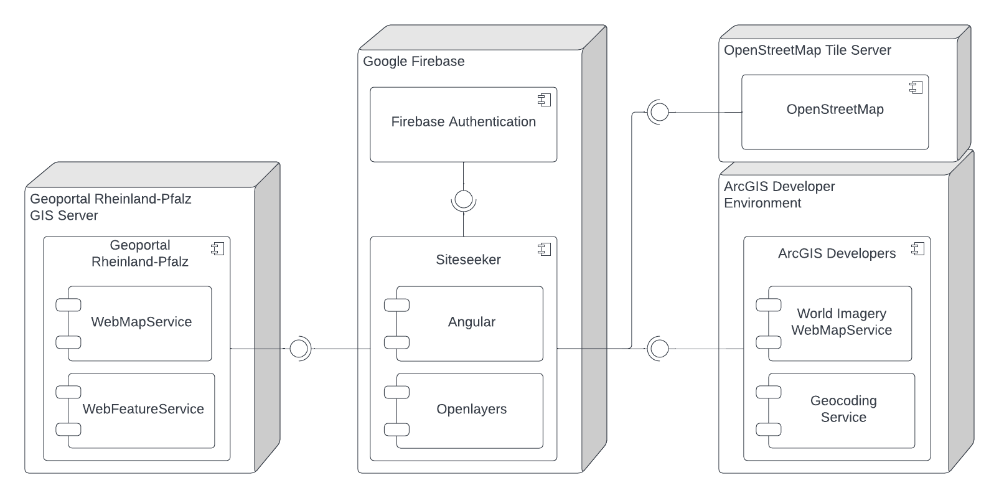

# Siteseeker
Hi there and welcome to the repository of the Siteseeker! 

The Siteseeker is the prototype for an application that supports location canvassers in the telecommunications industry in Germany. It consolidates data from different public sources to enable a smoother experience. 

At first glance, the canvasser receives the context of the site search area that is important to them: the number and details of public properties including contact options, the integration of protected areas, and information about the local administrative structure. In addition, detailed cadastre information from the real estate registers can be displayed directly in order to get to the next steps in the site development more quickly.

This project has been developed with sweat and love by the [Tech4Germany Cohort of 2022](https://digitalservice.bund.de/fellowships/tech4germany/projekte-2022#:~:text=Prozessoptimierung%20im%20Mobilfunkausbau) in collaboration with the [Federal Ministry for Digital and Transportation - DK14](https://bmdv.bund.de/EN/Home/home.html). More detailed information on the project can be found [here](https://tech.4germany.org/projekte/).

The prototype can be found in the [user-interface](user-interface) directory. The [summary-site](summary-site) directory contains a showcase website for the prototype. 


## Development
This prototype has been developed in Typescript with the Angular Framework and was generated with [Angular CLI](https://github.com/angular/angular-cli) version 14.2.1.

### Quick start
To get right into it you can run the development server on your local machine. For this to work follow these steps:
- Install the Angular cli with: `npm install -g @angular/cli`
- Navigate to the project root: `cd user-interface`
- Install the project dependencies: `npm install`
- Make sure to add the API keys (see next subsection)
- Run `ng serve` for a dev server 
- Navigate to `http://localhost:4200/`. The application will automatically reload if you change any of the source files.

#### API keys
To get the application to run with all its features, you need to add a file called `api-keys.ts` in the directory `user-interface/src/environments`. This file contains the all used API keys.

You need to register the prototype with your firebase project via the [Firebase CLI](https://firebase.google.com/docs/cli). Please initialise the project at least with firebase authentication, as the app relies on this for the login. Optionally you can also add the hosting option for deployment.
Add the Firebase API configuration in the `user-interface/src/environments/api-keys.ts` like so:
```
export const firebaseConfig = {
  apiKey: '',
  authDomain: '',
  projectId: '',
  storageBucket: '',
  messagingSenderId: '',
  appId: '',
  measurementId: '',
};
```

To use the reverse geocoding feature, add the ArcGIS Developers API Key to the file like so:
```
export const reverseGeocodeAPIKey: string = 'Your-API-Key';
```


#### Code scaffolding

Run `ng generate component component-name` to generate a new component. You can also use `ng generate directive|pipe|service|class|guard|interface|enum|module`.


## System Architecture


The Siteseeker Prototype consumes data from other outside services and uses a map framework to visualize the data in an Angular based Web App. In the following we want to elaborate on the different components that we utilised, which are displayed in the deployment diagram above.  

### Angular & UI Library
We use the web application framework [Angular](https://angular.io/) as the base platform for our web application. It provides us with a framework for routing and bundling the application, and delivers a rich ecosystem of tools and libraries.  

For component styling and icons we utilise [Bootstrap 5](https://getbootstrap.com/docs/5.2/getting-started/introduction/) and [Bootstrap icons](https://icons.getbootstrap.com/) .

### Map Framework
The application heavily relies on the map framework [Openlayers](https://openlayers.org/) for displaying and manipulating geo data. It makes it possible to layer different maps and view over one another to build a composite view. 

### Geo Data Sources
For the base maps the application relies on data from [OpenStreetMap](https://www.openstreetmap.org/#map=14/50.8061/7.6028) as well as satellite imagery from [ArcGIS](https://www.arcgis.com/home/item.html?id=10df2279f9684e4a9f6a7f08febac2a9). Further more we utilise the open APIs of the local [cadastre of Rhineland-Palatinate](https://www.geoportal.rlp.de/) to query maps and metadata on public infrastructure, protected areas, etc.

### Reverse Geocoding
To resolve coordinates to addresses, we utilise reverse geocoding. For this we call the [ArcGIS Geocoding Service](https://developers.arcgis.com/rest/geocode/api-reference/overview-world-geocoding-service.htm).


### API types
The application connects to different types of APIs to ingest data:
- [RESTful](https://en.wikipedia.org/wiki/Representational_state_transfer): Used for manuel queries of metadata. Returned data is in [JSON](https://en.wikipedia.org/wiki/JSON) or [GeoJSON](https://en.wikipedia.org/wiki/GeoJSON) format
- [WebMapService](https://en.wikipedia.org/wiki/Web_Map_Service): Used to ingest pre-rendered map data in image format. Reequest replies are in XML format
- [WebFeatureService](https://en.wikipedia.org/wiki/Web_Feature_Service): Used to query vector format data and metadata. Request replies are in mostly in GeoJSON or in [GML](https://en.wikipedia.org/wiki/Geography_Markup_Language).

All API calls are handled by services in the [core module](user-interface/src/app/core/services). 

### Proxy
To work around [Cross-Origin-Request-Blocking](https://en.wikipedia.org/wiki/Cross-origin_resource_sharing) by external servers (e.g. the cadastre servers, where we cannot change the CORS policy), we utilize a proxy in local development to change the request origin. The proxy configuration can be found at ``user-interface/src/proxy.conf.json``.  

## Deployment
For deployment of the prototype, we use [Google Firebase Hosting](https://firebase.google.com/products/hosting). Make sure you have registered your app with firebase as explained in the Quick start section.
Then for deployment follow these steps:
- Run `ng build` to build the project. The build artifacts will be stored in the `dist/user-interface` directory.
- Run `firebase deploy` to deploy the app to firebase

# Roadmap
For an elaborate Roadmap on how this prototype should progress into a full-blown application, we ask you to please have a look at the issues in this repository. However, we are giving a brief overview on what should happen in the future here. 

